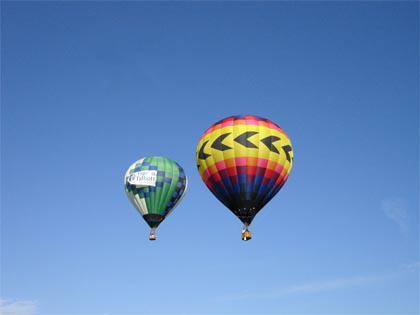
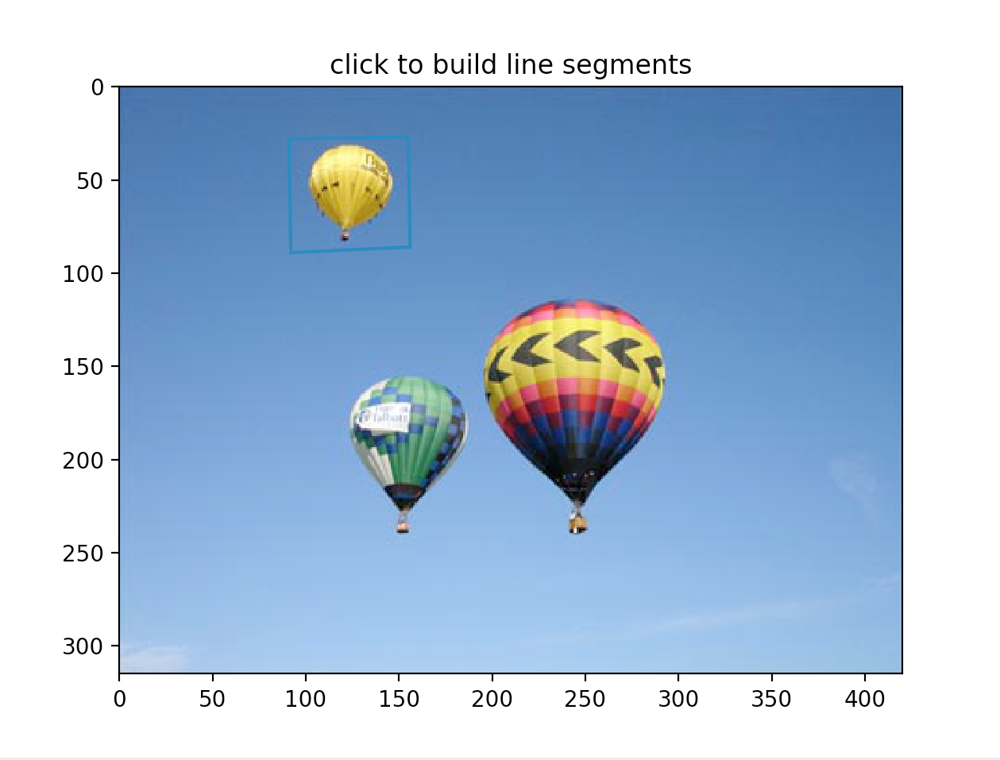
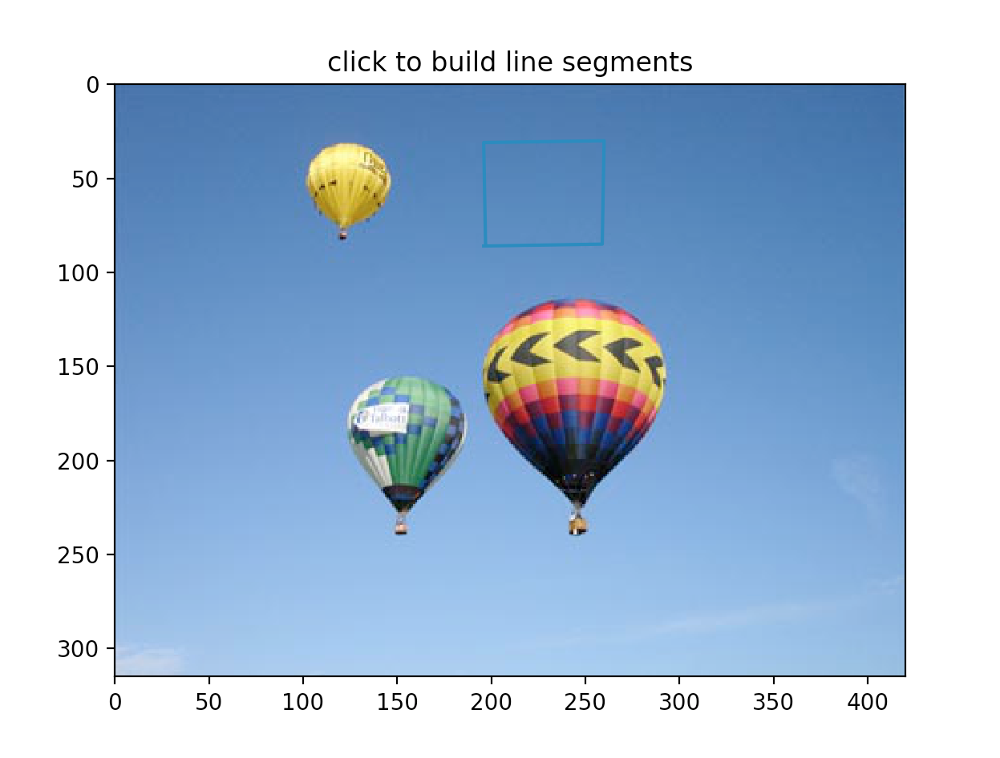
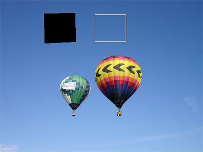
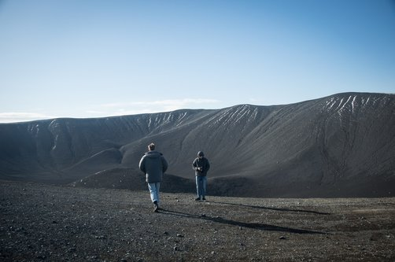
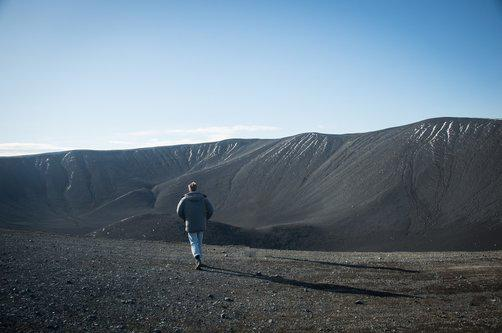
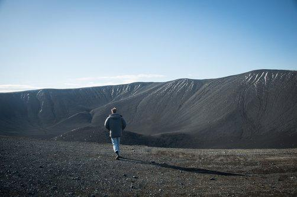

# Texture-synthesis

This project applies a texture synthesis method described here to fill in a region of an image with a texture. This method can be used to remove unwanted objects in an image. 

## Motivation

Suppose we take a picture of a scene but the scene includes some object that we don't want included. For example, perhaps we want to remove a hot air balloon from the image below:

We can apply the method implemented in this project to remove it:

## Getting started

clone the repo `git@github.com:evmarts/texture-synth.git`

run `python polyselect.py` (follow the command line prompts)

once you have selected both regions, run `python Holefill.py`

*note:* this method can have very long run-times for large images. 

## Examples

run `python polyselect.py`:   

~~~
path of image to modify (wrapped in ""):
"balloon.jpg"
Would you like to select the region to be filled (0) or the sample texture region (1)?
0 or 1: 1
~~~

A window will open with the image you want to modify. Build a box around the object in the scene you want to remove by clicking on the image. Close the window when you are done. (note the blue box around the top balloon)

run `python polyselect.py` again, this time to select the region to sample from:   

~~~

path of image to modify (wrapped in ""):
"balloon.jpg"
Would you like to select the region to be filled (0) or the sample texture region (1)?
0 or 1: 0

~~~

Another window with the image will open. This time build a box around the area you would like to sample texture from. Choose an area with similar texture as you would expect to be 'behind' the object you are removing. (note the blue box to the right of the upper balloon)

Next you want to run `python Holefill.py`

~~~
path of image to modify (wrapped in ""):
"balloon.jpg"
~~~

Two windows will open: one for the original image, and another window to show the two regions you have selected. 

~~~
Are you happy with this choice of fillRegion and textureIm?
Yes or No: Yes
~~~

The program will then start filling in the black area with texture synthesized from the area within the white box. (this process will take a while, especially for large images)

~~~
Number of pixels remaining =  3967
Number of pixels remaining =  3476
Number of pixels remaining =  3017
Number of pixels remaining =  2591
Number of pixels remaining =  2195
Number of pixels remaining =  1834
Number of pixels remaining =  1506
Number of pixels remaining =  1208
Number of pixels remaining =  943
Number of pixels remaining =  709
Number of pixels remaining =  508
Number of pixels remaining =  340
Number of pixels remaining =  202
Number of pixels remaining =  100
Number of pixels remaining =  32
~~~

Finally a window will open with your modified image!

Another example, this one required two runs: one to remove my friend and another to remove his shadow.

## Extras

visit https://una-dinosauria.github.io/efros-and-leung-js/ for a demo!